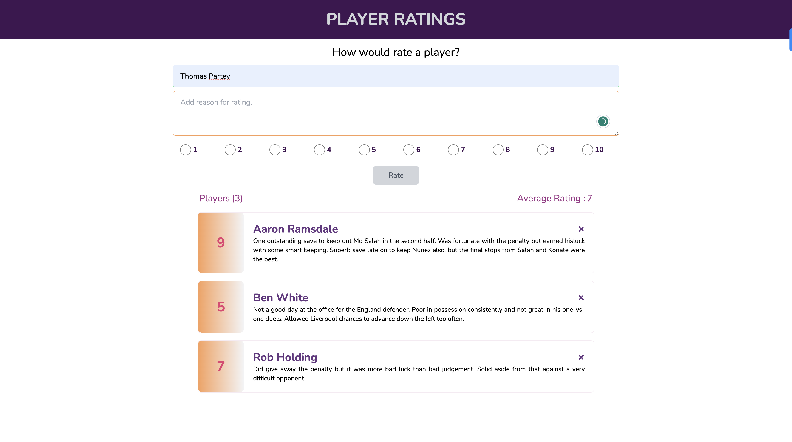

<a name="readme-top"></a>

<div align="center">
  <h3><b>PlAYER RATINGS APP</b></h3>
</div>

<!-- TABLE OF CONTENTS -->

# 📗 Table of Contents

- [📖 About the Project](#about-project)
  - [🛠 Built With](#built-with)
    - [Tech Stack](#tech-stack)
    - [Key Features](#key-features)
  - [🚀 Live Demo](#live-demo)
- [💻 Getting Started](#getting-started)
  - [Setup](#setup)
  - [Prerequisites](#prerequisites)
  - [Install](#install)
  - [Usage](#usage)
  - [Run tests](#run-tests)
  - [Deployment](#deployment)
- [👥 Authors](#authors)
- [🔭 Future Features](#future-features)
- [🤝 Contributing](#contributing)
- [⭐️ Show your support](#support)
- [🙏 Acknowledgements](#acknowledgements)
- [❓ FAQ (OPTIONAL)](#faq)
- [📝 License](#license)

<!-- PROJECT DESCRIPTION -->

# 📖 Player Ratings App <a name="about-project"></a>

**Player Ratings App** is a simple React app that helps the user to collect ratings of football players after a game.
Rate your players out of 10 depending on how they performed in the game.
Developed using React, and the app state managed using React Hooks (Going up and down the app)

## 🛠 Built With <a name="built-with"></a>

### Tech Stack <a name="tech-stack"></a>

<details>
  <summary>Client</summary>
  <ul>
    <li><a href="https://reactjs.org/">React.js</a></li>
  </ul>
</details>

<details>
  <summary>Server</summary>
  <ul>
    <li>N/A</li>
  </ul>
</details>

<details>
<summary>Database</summary>
  <ul>
    <li>N/A</li>
  </ul>
</details>

<!-- Features -->

### Key Features <a name="key-features"></a>

- **[key_feature_1]** Add Player details
- **[key_feature_2]** Add player rating and reason for the rating.
- **[key_feature_3]** Add rating and also delete unwanted rating

<p align="right">(<a href="#readme-top">back to top</a>)</p>

### Screenshot



<!-- LIVE DEMO -->

## 🚀 Live Demo <a name="live-demo"></a>

- [Live Demo Link](https://rating-players-derrick.netlify.app/)

<p align="right">(<a href="#readme-top">back to top</a>)</p>

<!-- GETTING STARTED -->

## 💻 Getting Started <a name="getting-started"></a>

To get a local copy up and running, follow these steps.

### Prerequisites

In order to run this project you need:
  - Node.js installed
  - VS Code
  - Chrome Browser

<!--
Example command:

```sh
 gem install rails
```
 -->

### Setup

Clone this repository to your desired folder:

```sh
  cd my-folder
  git clone git@github.com:inspecta/player-ratings.git
```

### Install

Install this project with:

```sh
  cd my-project
  npm install
```

### Usage

To run the project, execute the following command:

```sh
  npm start
```

### Run tests

To run tests, run the following command:

- None at the moment

<!--
Example command:

```sh
  bin/rails test test/models/article_test.rb
```
--->

### Deployment

You can deploy this project using Netlify


<p align="right">(<a href="#readme-top">back to top</a>)</p>

<!-- AUTHORS -->

## 👥 Authors <a name="authors"></a>

👤 **Author1**

- GitHub: [@inspecta](https://github.com/inspecta)
- LinkedIn: [LinkedIn](https://linkedin.com/in/mulinde-derrick)
- Frontend Mentor: [@inspecta](https://www.frontendmentor.io/profile/inspecta)

<p align="right">(<a href="#readme-top">back to top</a>)</p>

<!-- FUTURE FEATURES -->

## 🔭 Future Features <a name="future-features"></a>

- [ ] **[new_feature_1]** I hope to add animation features
- [ ] **[new_feature_2]** More CRUD operations (Edit and Update Ratings)
- [ ] **[new_feature_3]** User feedback features after an operation

<p align="right">(<a href="#readme-top">back to top</a>)</p>

<!-- CONTRIBUTING -->

## 🤝 Contributing <a name="contributing"></a>

Contributions, issues, and feature requests are welcome!

Feel free to check the [issues page](../../issues/).

<p align="right">(<a href="#readme-top">back to top</a>)</p>

<!-- SUPPORT -->

## ⭐️ Show your support <a name="support"></a>

If you like this project, go ahead and give it a star.

<p align="right">(<a href="#readme-top">back to top</a>)</p>

<!-- ACKNOWLEDGEMENTS -->

## 🙏 Acknowledgments <a name="acknowledgements"></a>

I would like to thank my mother for her continued support.

<p align="right">(<a href="#readme-top">back to top</a>)</p>

<!-- FAQ (optional) -->

## ❓ FAQ (OPTIONAL) <a name="faq"></a>

- **Can I fork this repository?**

  - Sure you can.

- **Can I contribute to this project?**

  - Yes please. Contact me at **djmulinde@gmail.com** and I will add you as a contributor.

<p align="right">(<a href="#readme-top">back to top</a>)</p>

<!-- LICENSE -->

## 📝 License <a name="license"></a>

This project is [MIT](./LICENSE) licensed.

<p align="right">(<a href="#readme-top">back to top</a>)</p>
